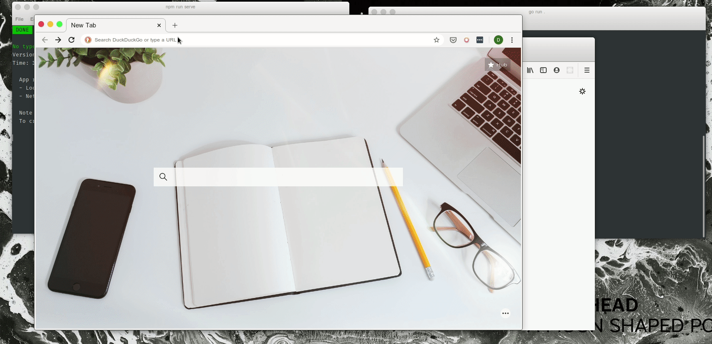

# Chat Microservice

A socket.io server that does nothing but maintain socket connections for a chat room.

Try it out and use it with a frontend such as [this one](https://github.com/sharmarajdaksh/vue-vchat).

All the code in a single file? Yeah I understand best practices weren't followed but this was mainly about trying out how to do websockets in Go.
